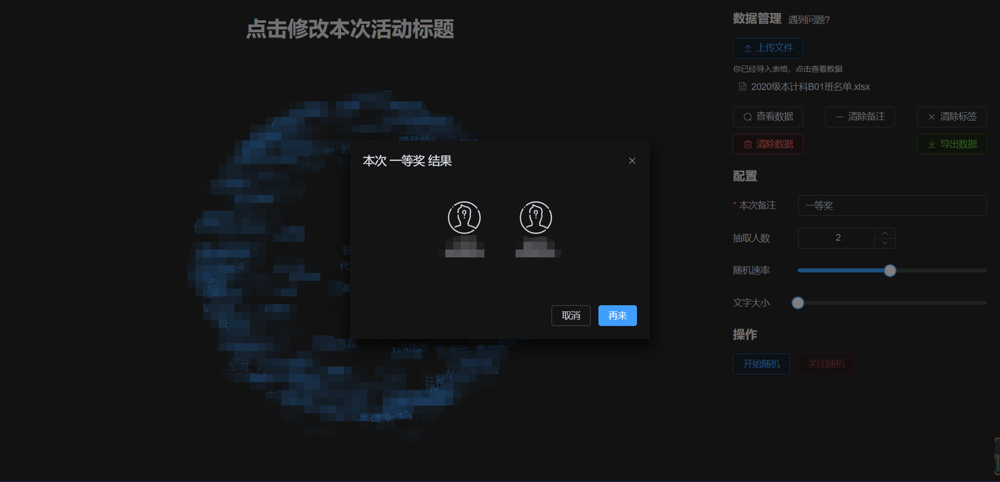

# 项目说明

适合于班级中随机抽人的一款小工具，数据来源于表格，也可以选择导出表格。数据导入之后保存在浏览器本地存储中，浏览器发生意外关闭也不会清除。

导入数据之后：


随机抽取结果：



数据管理，查看已随机的人：


# 运行项目

快速预览：https://himmelbleu.gitee.io/luck-draw

推荐克隆本仓库到本地，进入根目录执行以下指令：

```bash
npm install
npm run dev
```

# 操作步骤

导入表格数据，表格必须包含“学号”、“姓名”这两列：

|   学号   | 姓名 |
| :------: | :--: |
| 42020xxx | 张三 |

1. 如果你没有导入表格数据，上传文件按钮下会提示。如果程序发生了错误，请刷新页面重新导入表格数据。如果你的表格数据有问题，可以选择“清除数据”重新导入。

2. 默认一次抽取 1 个人，可以设置一次性抽取多个人。

3. 每一轮随机之前都要写一个备注，用于记录当前这些被抽到的人参与什么项目（或活动），比如本次抽取的人要上台表演。

4. 每一轮随机的人都会被标记一个 true，这是程序用于区分整个随机流程中不再继续参与的标志。可以选择“清除标签”，其余的人又可以继续参与随机抽人的流程。

5. 随机抽人时，点击“开始随机”，页面默认间隔 120 ms 随机展示人的姓名和学号。你也可以调整随机的速率。

6. 如果显示的结果很小，可以滑动“文字大小”，调整字体大小。

7. 可以点击标题进行修改。

如果你导入数据之后，页面中间没有显示球形特效，请刷新再继续。

# 导出数据

点击导出数据，你将得到一个如下结构的表格：

|   学号   | 姓名 |       备注       | 标签 |
| :------: | :--: | :--------------: | :--: |
| 420200xx | 张三 | 一等奖；二等奖； | TRUE |
| 420201xx | 李四 |  上台表演相声；  | TRUE |

# 项目 BUG

由于时间限制和精力，目前存在一个重大 BUG 可能会影响整个随机抽人的流程。

对于每轮只抽取 1 个人的情况，如果总数是 33 个人。当 32 个人的标签列都是 true 的情况下，再继续“开始随机”，此时程序会卡死。
